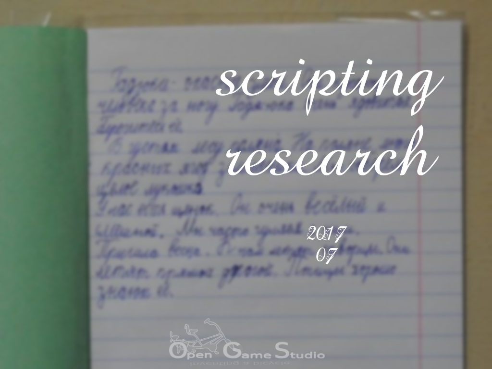

Title: Scripting research
Date: 2017-08-16 00:00
Category: News
Slug: scripting-research
Lang: en

This article describes scripting research in July 2017.

**Our first goal of using a scripting language was to have a platform-independent code that runs unchanged on every supported platform.**

OGS Editor 0.10 supports Python for such a code thanks to [SWIG](http://swig.org/). SWIG provides a way to wrap almost any C/C++ code and use it in dozens of languages like Python, Ruby, Lua, Java, C#, etc.. SWIG really helped us taste the beauty of platform-independent code. However, SWIG only works one way: from C/C++ to a target language. This means the main application must be in the target language, and C/C++ code can only be used as a library.

Having the main application in Python works fine for the desktop, but not so great for mobile and web, where C and C++ are the only natively supported cross-platform languages. There are projects like [Kivy](https://kivy.org), which allow you to develop cross-platform applications in Python, but they are not supported natively. This means it's a lot of headaches when Android and iOS APIs change.

Having the main application in C/C++ and the need to support scripting means that a scripting language should be interpreted by the application. This is what SWIG, Kivy, and similar projects are not meant to fulfill.

**Our secondary goal for using a scripting language was to allow to extend C++ code.**

OGS Editor 0.10 has some modules written in C++, and some in Python. The modules are equal from the perspective of the main application; it doesn't care what language the module is written in.

To achieve such flexibility, we introduced a so-called Environment. Each module would register the keys it responds to, and Environment would deliver corresponding messages. 
Technically such behaviour is achieved by inheriting a base class and overriding its methods in both C++ and a scripting language.

**First, we evaluated Python for the role of cross-platform scripting language.**

Since we already used Python, we started to research the possibility to run Python code on every supported platform. The result was disappointing because CPython (the default Python implementation used on the desktop) does not mention mobile and web platforms. We only found some years old forks of CPython that were claimed to work either on Android or iOS. Such a disarray was not suitable for us.
We also had a look at [PyPy](http://pypy.org), another Python implementation. It also did not mention support for mobile and web platforms.

This was a clear indication that Python community doesn't care for mobile and web platforms. Or that nobody had time to provide the information about building Python on such platforms. Either way, it was not acceptable for us.

**Second, we evaluated [Wren](http://wren.io) for the role of cross-platform scripting language.**

Wren was the first scripting language we stumbled upon in the long list of non-mainstream scripting languages.

Wren claimed to be small and easy to learn. Wren also claimed to be intended for embedding in applications. Ironically, the author [had no time to document how to do the embedding in the first place](http://wren.io/embedding-api.html). When [we asked for the time estimates of publishing](https://github.com/munificent/wren/issues/465) the critical part of the documentation, [we just got a reference to another issue](https://github.com/munificent/wren/issues/402) where the other guy was asking the same question half a year ago!

That's when we ended our relationship with Wren.

**Third, we evaluated [Chai](http://chaiscript.com) for the role of cross-platform scripting language.**

Chai was in the long list of non-mainstream scripting languages, too. Chai was promising because it claimed to be specifically tailored for embedding in a C++ application.
We successfully managed to call a C++ function from inside Chai but failed to call a member function. [We asked for help](http://discourse.chaiscript.com/t/cannot-call-a-function-that-accepts-a-string-and-a-vector/334), but nobody replied.

We had to end our relationship with Chai.

**Fourth, we evaluated Lua for the role of cross-platform scripting language.**

Lua is the mainstream language for embedding. So we decided to try the obvious choice. Documentation looked promising, too. However, by the end of reading the [C API](https://www.lua.org/pil/24.html) chapter we had no clue how to inherit a class inside Lua.

This led us to search for libraries that wrap Lua C API syntax into something more meaningful for C++. That's how we found [Sol2](http://sol2.rtfd.io). Just as before, the first attempt to call a C++ member function from Lua failed. But unlike before, we asked for help and [got the help](https://github.com/ThePhD/sol2/issues/465)! This was a refreshing surprise for us.
Next, we tried to inherit a class in Lua and override the class methods. We failed, but [the author helped us out again](https://github.com/ThePhD/sol2/issues/468). In the end, we succeeded in inheriting a class and overriding its behaviour.

That's when we understood it's a start for a long and mutual relationship with Sol2/Lua.

**This search for a scripting language taught us one important lesson: people matter, not technologies.**

There are lots of scripting languages that look shiny on the outside but are dead. Why? Because some authors don't have time for users. In return, users don't have time for the authors' projects.

That's it for describing scripting research in July 2017.

